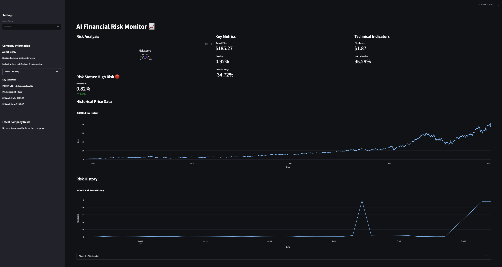

# AI Financial Risk Monitor 📈

An advanced financial risk monitoring system that leverages artificial intelligence and machine learning to provide real-time risk assessment and market analysis.



## Overview

The AI Financial Risk Monitor is a sophisticated platform designed to help investors, traders, and financial analysts make data-driven decisions by monitoring and analyzing market risks in real-time. By combining traditional financial metrics with advanced machine learning algorithms, the system provides comprehensive risk assessments and predictive insights for various financial instruments.

### Key Features

- **Real-time Market Analysis**: 
  - Live data processing from multiple financial markets
  - Instant risk score calculations
  - Dynamic technical indicator updates

- **Advanced ML Models**:
  - Random Forest Classification for risk pattern recognition
  - Local Outlier Factor (LOF) for anomaly detection
  - Hybrid approach combining multiple ML techniques

- **Interactive Dashboard**:
  - Clean, intuitive dark-themed interface
  - Real-time data visualization
  - Customizable risk metrics and alerts
  - Historical price and risk trend analysis

- **Comprehensive Risk Assessment**:
  - Multi-factor risk analysis
  - Volume and price movement analysis
  - Technical indicator integration
  - Historical pattern recognition

## Technical Architecture

The system is built using a modern tech stack:
- Python-based backend with FastAPI
- Streamlit for interactive frontend
- Scikit-learn for ML models
- YFinance for real-time market data
- Plotly for advanced visualizations

## Setup
1. Clone the repository

```bash
git clone https://github.com/YOUR_USERNAME/ai-financial-risk-monitor.git
cd ai-financial-risk-monitor
```

2. Create and activate virtual environment

```bash
python -m venv venv
source venv/bin/activate  # On Windows: venv\Scripts\activate
```

3. Install dependencies

```bash
pip install -r requirements.txt
```

4. Run the dashboard

```bash
streamlit run src/dashboard.py
```

## Project Structure
```
ai-financial-risk-monitor/
├── src/
│   ├── dashboard.py        # Streamlit dashboard
│   ├── model.py           # ML model implementation
│   └── utils/
│       └── timing_utils.py # Timing utilities
├── assets/                # Image assets
├── data/                  # Data storage
├── logs/                  # Log files
├── requirements.txt       # Project dependencies
└── README.md             # Project documentation
```

## Use Cases

- **Portfolio Risk Management**: Monitor and assess risk levels across multiple assets
- **Trading Decision Support**: Get real-time insights for trading decisions
- **Market Analysis**: Analyze market trends and patterns
- **Risk Compliance**: Track and report risk metrics for compliance purposes

## Future Enhancements

- Integration with additional data sources
- Enhanced ML model capabilities
- Mobile application development
- API endpoint expansion
- Advanced alert system implementation

## Contributing

Contributions are welcome! Please feel free to submit a Pull Request. For major changes, please open an issue first to discuss what you would like to change.

## License

This project is licensed under the MIT License - see the LICENSE file for details.

## Acknowledgments

- Thanks to the open-source community for various tools and libraries
- Special thanks to contributors and testers
- Inspired by modern fintech solutions and risk management systems

---
